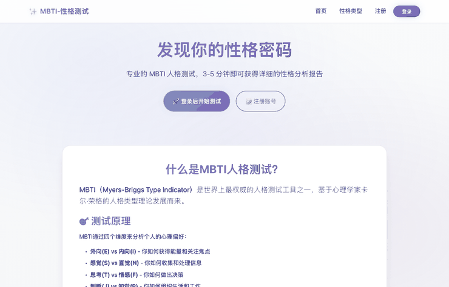
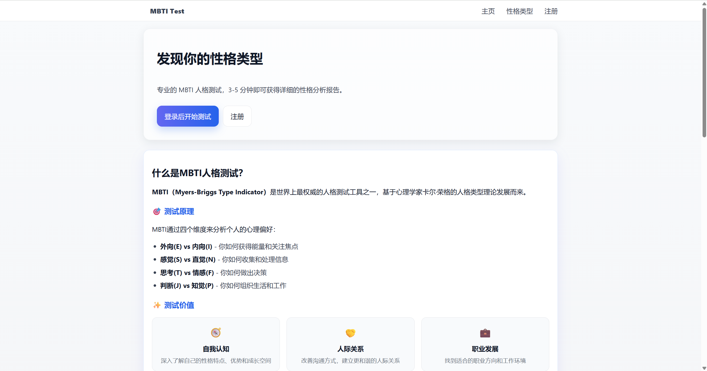
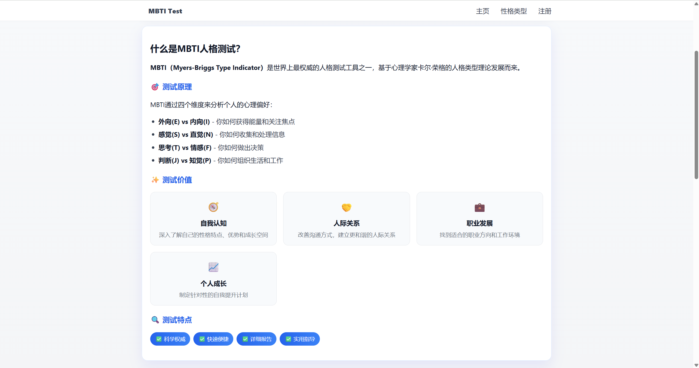
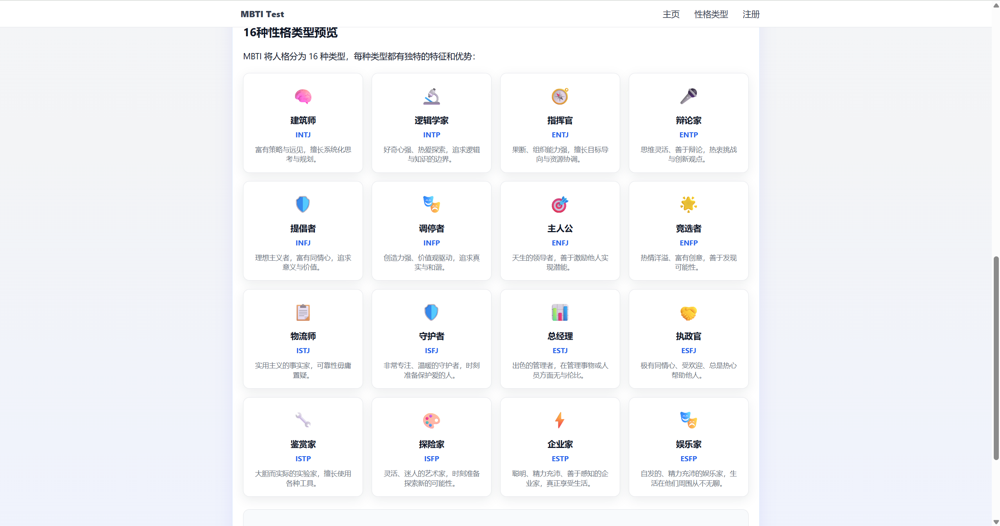
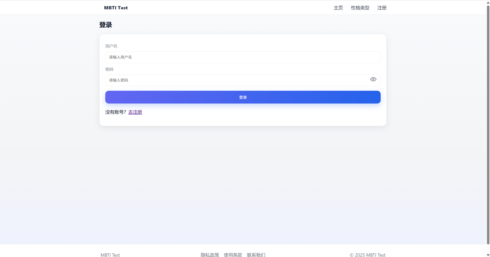
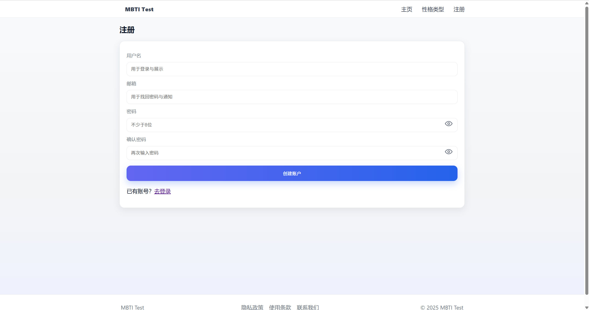
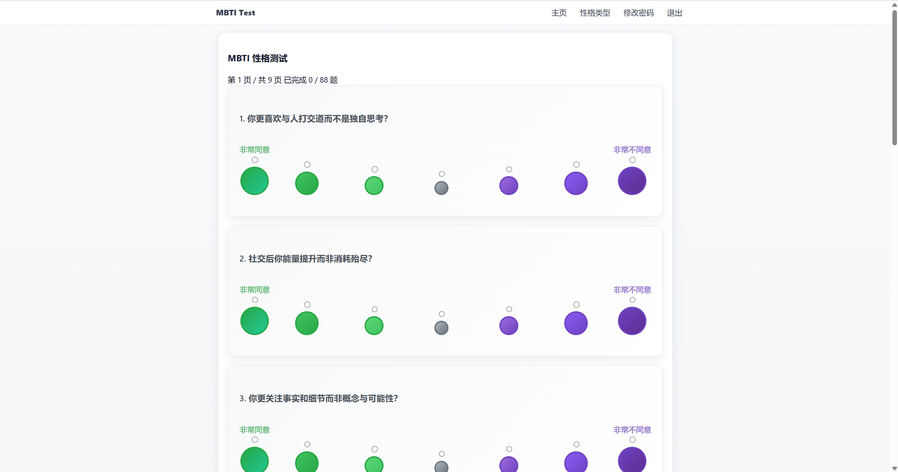
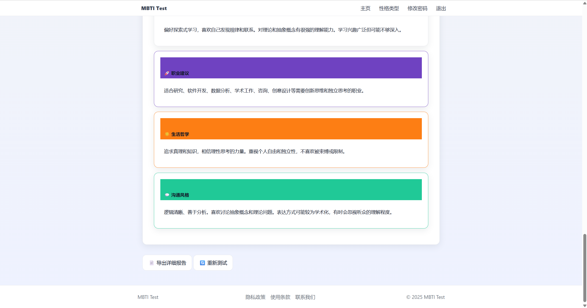
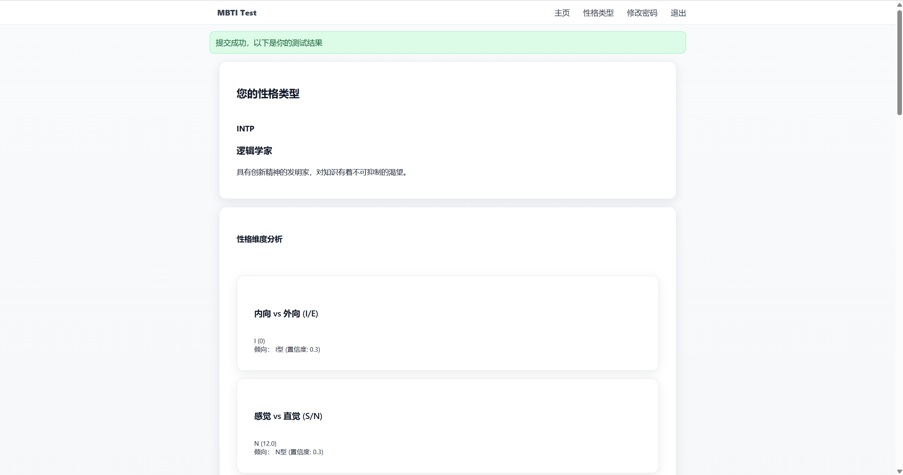
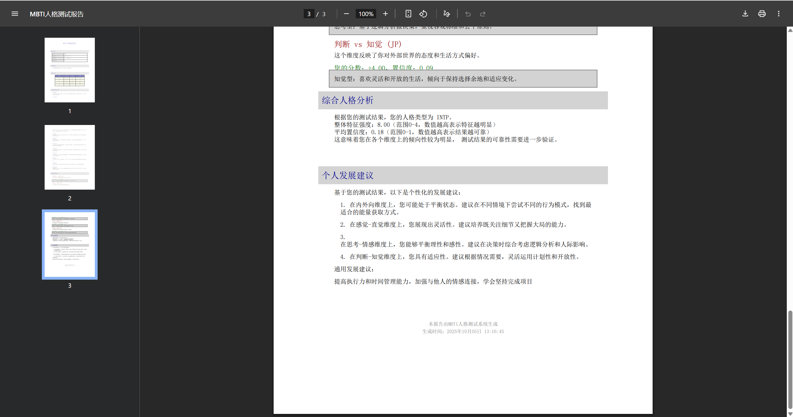

<div align="center">

# MBTI 性格测试系统

**93 道标准题，3 分钟出一份可下载的人格分析报告**

[](https://www.python.org/)
[](https://www.djangoproject.com/)
[](https://getbootstrap.com/)
[](https://www.reportlab.com/)
[](https://github.com/zcw576020095/mbti-test/stargazers)
[](https://github.com/zcw576020095/mbti-test/commits)
[](LICENSE)

[在线体验](#-在线体验) · [功能特性](#-功能特性) · [界面展示](#-界面展示) · [快速开始](#-快速开始) · [部署](#-生产部署) · [常见问题](#-常见问题)

答题进度自动落库，中途关掉浏览器回来接着答；<br>
四个维度各自给出置信度，而不是只丢给你一个四字母代号。



<sub>完整流程实录：浏览首页 → 登录 → 分页答题 → 生成报告</sub>

</div>

---

## 🌐 在线体验

**👉 [https://best-mbti-test.xin/](https://best-mbti-test.xin/)**

无需安装，注册即测。3-5 分钟拿到详细的性格分析报告，支持导出 PDF。

> 备案信息：京ICP备2025157088号

---

<table>
<tr>
<td width="25%" align="center"><b>标准 93 题</b><br><sub>四维度计分<br>同分有明确判定规则</sub></td>
<td width="25%" align="center"><b>进度不丢</b><br><sub>每页作答即时保存<br>翻页/关窗都能续上</sub></td>
<td width="25%" align="center"><b>置信度</b><br><sub>四个维度分别给<br>倾向有多明显一眼看到</sub></td>
<td width="25%" align="center"><b>PDF 报告</b><br><sub>ReportLab 生成<br>中文字体已处理</sub></td>
</tr>
</table>

---

## 🚀 功能特性

**测评流程**
- 标准 MBTI 93 题，每页 10 题分页作答，可随时返回上一页修改
- 答案即时写库，跨页、跨会话都不丢；未答完会提示还缺几题并定位过去
- 顶部实时显示完成度与进度条

**结果呈现**
- 四维度（IE / SN / TF / JP）分数、倾向与**各自的置信度**
- 生成类型码（如 `INTJ`），并展开该类型的多维解读：性格特点、工作风格、人际关系、
  情感表达、决策方式、压力管理、学习方式、职业建议、生活哲学、沟通风格
- 一键导出 PDF 报告

**账号与后台**
- 注册 / 登录 / 登出 / 改密码，密码框带显示切换
- Django Admin 管理题库、问卷、用户与测试结果

## 🛠️ 技术栈

| 层 | 选型 |
|---|---|
| 后端 | Django 5.2.6 |
| 前端 | Bootstrap 5 + 原生 JS（**已本地化，零 CDN 依赖**） |
| 数据库 | SQLite（默认） |
| PDF | ReportLab |
| 部署 | nginx 反代 + systemd + Let's Encrypt |

> 静态资源全部落在 `static/vendor/`，字体走系统字体栈。国内服务器不会因为
> CDN 连不上而样式错乱 —— 这是踩过之后改的（commit `60c4d46`）。

## 📋 系统要求

- Python 3.11+
- Django 5.2+
- 现代浏览器（Chrome / Firefox / Edge / Safari）

## 🔧 快速开始

### 1. 克隆与虚拟环境

```bash
git clone git@github.com:zcw576020095/mbti-test.git
cd mbti-test
python -m venv venv
source venv/bin/activate      # macOS / Linux
# venv\Scripts\activate       # Windows
```

### 2. 安装依赖

```bash
pip install -r requirements.txt
```

> `reportlab` 只有 PDF 导出用得到，不需要该功能可以不装。

### 3. 建表

```bash
python manage.py migrate
```

模型有改动时才需要先 `makemigrations`。首次直接 `migrate` 即可建好全部表。

### 4. 导入题库与人格数据

```bash
# 导入标准 93 题 + 创建后台管理员
python database_management/init_database.py

# 导入 16 种人格类型的详细解读（推荐，否则结果页只有类型码没有解读）
python database_management/populate_personality_data.py
```

脚本清单：

| 脚本 | 作用 |
|---|---|
| `init_database.py` | 导入 93 题题库 + 创建管理员 |
| `add_questions_from_json.py` | 只导题库，不建账号 |
| `populate_personality_data.py` | 导入 16 型详细解读，`get_or_create` 可重复跑 |
| `clear_database.py` | 清空测试数据，保留超级用户 |

默认管理员：`admin` / `admin@123..`，登录地址 `/admin/`。
**部署到公网前请先改掉这个密码。**

### 5. 启动

```bash
python manage.py runserver 127.0.0.1:8000
```

打开 http://127.0.0.1:8000 。

> 题库说明：官方 MBTI 题目与评估工具受版权与商标保护。本项目题库为开放版、
> 结构兼容的替代方案，计分逻辑见 `mbti/services_standard.py`。

## 🎨 界面展示

截图位于 [`screenshots/`](screenshots/) 目录。

### 首页





### 登录与注册

| 登录 | 注册 |
|:---:|:---:|
|  |  |

### 答题

| 测试页 | 测试详情 |
|:---:|:---:|
|  |  |

### 结果与报告



| PDF 报告 · 1 | PDF 报告 · 2 |
|:---:|:---:|
|  |  |

## 📁 项目结构

```
mbti-test/
├── manage.py
├── requirements.txt
├── db.sqlite3                   # SQLite（不入版本库）
├── mbti_site/                   # 项目配置
│   ├── settings.py
│   ├── urls.py
│   └── wsgi.py
├── mbti/                        # 测评应用
│   ├── models.py                # Questionnaire / Question / Response / Result / TypeProfile
│   ├── views.py                 # 答题、保存、提交、结果、PDF
│   ├── services_standard.py     # 标准 93 题计分
│   ├── services.py              # Likert 计分（兼容旧问卷）
│   └── admin.py
├── users/                       # 账号应用
├── database_management/         # 初始化与导入脚本
├── data/
│   └── questions_standard_mbti_93.json
├── templates/
├── static/
│   ├── css/style.css
│   └── vendor/                  # Bootstrap 本地副本
├── staticfiles/                 # collectstatic 产物（不入版本库）
├── docs/images/                 # README 演示动图
└── screenshots/
```

## 🧭 路由

| 端点 | 方法 | 说明 |
|---|---|---|
| `/` | GET | 首页，介绍与 16 型科普 |
| `/test/` | GET | 答题页（分页） |
| `/save-progress/` | POST | 保存当页作答（AJAX） |
| `/submit/` | POST | 提交并计算结果 |
| `/result/` | GET | 结果页 |
| `/result/pdf/` | GET | 导出 PDF 报告 |
| `/users/login/` | GET/POST | 登录 |
| `/users/register/` | GET/POST | 注册 |
| `/users/password-change/` | GET/POST | 修改密码 |
| `/admin/` | GET | Django 后台 |

## 📊 计分说明

采用**标准 MBTI 93 题**规则：

- 每题二选一，按题目所属维度与方向累加
- 四个维度：IE（外向-内向）、SN（感觉-直觉）、TF（思考-情感）、JP（判断-知觉）
- 每个维度取高分一侧；**同分按固定规则**判定：E/I 同分取 I、S/N 同分取 N、
  T/F 同分取 F、J/P 同分取 P
- 置信度由该维度两侧分差除以该维度满分得出，用于判断倾向是否明显

实现见 `mbti/services_standard.py`。

## 🔐 安全

- CSRF 保护、会话管理、密码哈希存储
- 生产环境需关闭 `DEBUG`、收紧 `ALLOWED_HOSTS`、配置 `CSRF_TRUSTED_ORIGINS`
- `SECRET_KEY` 通过环境变量 `DJANGO_SECRET_KEY` 注入，不要沿用代码里的兜底值

## 🚀 生产部署

以 nginx 反代 + systemd 托管为例。

**1. 收集静态文件**（这一步不能省）

```bash
python manage.py collectstatic --noinput
```

**2. nginx 的 `/static/` 指向 `STATIC_ROOT`**

```nginx
location /static/ {
    alias /opt/mbti-test/staticfiles/;   # 不是项目的 static/
    expires 7d;
}

location / {
    proxy_pass http://127.0.0.1:8000;
    proxy_set_header Host              $host;
    proxy_set_header X-Forwarded-Proto $scheme;
    proxy_set_header X-Real-IP         $remote_addr;
}
```

> ⚠️ 必须指向 `collectstatic` 的产物目录。Django Admin 的 CSS/JS 打包在
> `django.contrib.admin` 包内，不收集就只存在于 site-packages 里；而 nginx 的
> `/static/` 是前缀匹配，会抢在反代之前吃掉所有 `/static/` 请求，Django 再也没机会
> 自己发这些文件 —— 结果就是后台页面样式全 404。

**3. HTTPS 下 Django 要补的配置**

```python
SECURE_PROXY_SSL_HEADER = ("HTTP_X_FORWARDED_PROTO", "https")
CSRF_TRUSTED_ORIGINS = ["https://your-domain.com"]
SESSION_COOKIE_SECURE = True
CSRF_COOKIE_SECURE = True
DEBUG = False
ALLOWED_HOSTS = ["your-domain.com"]
```

不加 `SECURE_PROXY_SSL_HEADER`，`request.is_secure()` 恒为 False，https 请求会被
重定向回 http；不加 `CSRF_TRUSTED_ORIGINS`，Django 4+ 会让登录、注册、提交答题
全部 CSRF 校验失败。

## ❗ 常见问题

**后台页面没有样式**
`/static/admin/css/base.css` 返回 404 就是这个原因：漏了 `collectstatic`，或者
nginx 的 `/static/` 指到了项目的 `static/` 而不是 `STATIC_ROOT`。按上面部署章节改。
自查命令：

```bash
curl -o /dev/null -w "%{http_code}\n" https://your-domain.com/static/admin/css/base.css
```

**PDF 中文乱码**
需要指向一个中文字体。通过环境变量 `PDF_FONT_PATH` 指定，或改
`mbti/views.py` 的 `result_pdf_view`。

**结果页只有类型码，没有详细解读**
没导人格数据，跑 `python database_management/populate_personality_data.py`。

**样式错乱 / 页面加载很慢**
本项目已把 Bootstrap 本地化，不依赖任何 CDN。如果仍然错乱，先确认
`/static/css/style.css` 能正常返回 200。

**迁移出错**
删掉 `db.sqlite3` 与 `mbti/migrations/` 下除 `__init__.py` 外的文件，
重新 `makemigrations` + `migrate`，然后重新导入题库。

## 📄 许可证

[MIT](LICENSE)

## 🙏 致谢

Django · Bootstrap · ReportLab

---

<div align="center">
⭐ 如果这个项目对你有帮助，欢迎点个 Star
</div>
