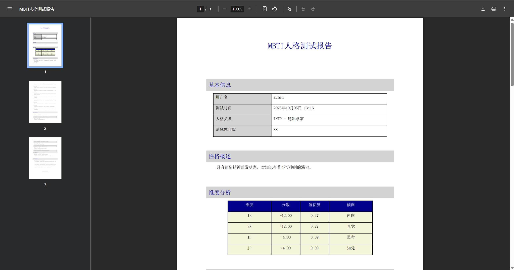

# MBTI 性格测试系统

一个基于 Django 的 MBTI 性格测试系统，支持登录、分页答题、进度自动保存、结果计算与 PDF 导出。

## 🚀 功能特性
- 用户注册、登录、登出，统一的消息提示（成功/失败原因）
- MBTI 测试分页（每页 10 题），返回上一页保留答案
- 自动保存答题进度（Session 存储，跨页不丢失）
- 完成度与进度条展示，未完成时友好提示定位
- 结果计算与类型码生成（如 INTJ），维度置信度与详情展示
- 导出测试结果为 PDF 报告（ReportLab，可选安装）
- 密码输入眼睛图标显示/隐藏，与输入框右侧对齐
- 开发环境下 `@vite/client` 路由占位，避免控制台 404 噪音

## 🛠️ 技术栈
- 后端：Django 5.2.6
- 前端：HTML5、CSS3、JavaScript（Bootstrap 5 样式）
- 数据库：SQLite（开发环境）
- PDF：ReportLab（可选）

## 📋 系统要求
- Python 3.11+（推荐）
- Django 5.2+
- 现代浏览器（Chrome / Firefox / Edge）

## 🔧 安装与配置
### 1. 进入项目目录并创建虚拟环境
```bash
cd mbti-system
python -m venv venv
venv\Scripts\activate  # Windows
# 或
source venv/bin/activate  # macOS/Linux
```

### 2. 安装依赖
```bash
pip install -r requirements.txt
```
> 说明：`reportlab` 为 PDF 导出所需的可选依赖，若不需要 PDF 功能可不安装。

### 3. 初始化数据库
```bash
python manage.py makemigrations
python manage.py migrate
```

### 4. 创建超级用户（可选）
```bash
python manage.py createsuperuser
```

### 5. 启动开发服务器
```bash
python manage.py runserver 127.0.0.1:8000
```
访问 `http://127.0.0.1:8000`。

## 🧪 初始化题库与类型资料
本项目提供了脚本与数据文件来导入题库与 16 种人格类型说明。

### 导入题库（开放版）
- 题库文件位置：`data/questions_open_mbti_cn.csv`
- 在项目根目录执行：
```bash
# Windows PowerShell（确保已安装依赖并完成数据库迁移）
python add_questions.py
```
- 脚本行为：
  - 读取 `data/questions_open_mbti_cn.csv`，将题目写入数据库（存在则更新）
  - 自动创建/更新问卷并激活（优先激活包含题目最多的问卷，如 `mbti_open_v1`）
  - 若 CSV 缺失，脚本会回退到内置的题库列表

### 导入性格类型资料
- 脚本路径：`populate_personality_data.py`
- 在项目根目录执行：
```bash
python populate_personality_data.py
```
- 脚本行为：
  - 将 16 种类型（如 `INTJ`、`ENFP` 等）的名称、描述、优势、成长建议、人格特质、工作风格、沟通风格等写入 `TypeProfile` 表中
  - 使用 `get_or_create` 创建记录；若已存在则更新字段，可安全重复执行

> 注意：官方 MBTI 题库与评估工具受版权与商标保护，禁止在未经授权的情况下复刻。当前题库为开放版、结构兼容的替代方案，评分逻辑位于 `mbti/views.py`，使用 5 点量表标准化到 [-2..+2] 并按 `keyed_pole` 累加到四个维度（IE、SN、TF、JP）。

## 📁 主要结构
```
mbti-system/
├── manage.py
├── mbti_site/             # 项目配置
│   ├── settings.py        # Django 设置
│   └── urls.py            # 主路由（含 @vite/client 占位）
├── mbti/                  # MBTI 应用
│   ├── models.py          # 问题/回答/结果/类型档案
│   ├── urls.py            # MBTI 路由
│   └── views.py           # 测试/保存/提交/结果/PDF 导出
├── users/                 # 用户应用
│   ├── forms.py           # 登录/注册/修改密码表单
│   └── views.py           # 登录/注册/登出，消息提示
├── templates/
│   ├── base.html          # 全局模板，消息渲染与样式
│   ├── users/             # 登录/注册/修改密码
│   └── mbti/              # 测试/结果
└── static/
    └── css/style.css      # 样式（含密码眼睛图标定位）
```

## 🎨 界面展示
以下截图均位于 `screenshots/` 目录，命名与 `django-auth-system/README.md` 风格一致：

### 主页（Index）


### 登录页面


### 注册页面


### 测试详情


### 测试结果


### PDF 测试报告



## 🧭 使用指南
### 1. 登录与注册
- 进入登录或注册页，密码框右侧有眼睛图标可切换显示/隐藏。
- 登录成功或失败（如用户名/密码错误）将通过顶部消息区域进行提示。

### 2. 进行 MBTI 测试
- 每页 10 题，可点击“下一页/上一页”。
- 选择选项会自动保存到 Session；返回上一页不会丢失选择。
- 未完成当前页题目时，点击下一步会弹出提示并定位到未完成题目。

### 3. 提交与结果
- 提交前需完成所有题目，系统会校验并提示缺失数量。
- 结果页显示四维度分数与倾向，生成类型码（如 `INTJ`）。
- 可将结果导出为 PDF 报告（需安装 `reportlab`）。

## 📝 API 文档

| 端点 | 方法 | 描述 |
|------|------|------|
| `/` | GET | 主页或入口（按项目配置） |
| `/mbti/` | GET | MBTI 首页 |
| `/mbti/test/` | GET | 测试页（支持分页） |
| `/mbti/save-progress/` | POST | 保存作答进度（AJAX，会话存储） |
| `/mbti/submit/` | POST | 提交答案并计算结果 |
| `/mbti/result/` | GET | 结果展示 |

## 📊 结果计算说明（概要）
- 评分基于 Likert 量表，标准化为 [-2..+2] 并按题目倾向方向加权累加至维度。
- 四个维度：IE、SN、TF、JP；分数的正负决定最终类型的字母选择。
- 置信度按各维度平均绝对分值归一化（0..1），用于辅助解释可靠性。

## 🔐 安全特性
- CSRF 保护、会话管理
- 密码哈希存储
- 基于消息框的统一错误与成功提示

## ❗ 常见问题
- `@vite/client` 404：项目在 `mbti_site/urls.py` 中提供占位路由，开发环境下避免控制台报错。
- PDF 字体乱码：Windows 下自动尝试注册常见中文字体；如仍异常可在代码中自定义字体路径。
- 静态文件：开发环境确保 `DEBUG=True`；生产环境需收集静态文件并配置服务器。

## 🚀 生产部署（示例）
```bash
pip install gunicorn
python manage.py collectstatic --noinput
# 示例：WSGI + 反向代理（略）
```

## ⬆️ 提交到 GitHub（SSH 方式）
以下步骤在 Windows PowerShell 中执行：
- 生成 SSH Key（推荐 Ed25519）：
```bash
ssh-keygen -t ed25519 -C "your_email@example.com"
```
- 将公钥内容（`%USERPROFILE%\.ssh\id_ed25519.pub`）添加到 GitHub：Settings → SSH and GPG keys → New SSH key。
- 验证连接：
```bash
ssh -T git@github.com
```
- 在项目根目录初始化并设置远程为 SSH：
```bash
cd mbti-system
git init
git config user.name "Your Name"
git config user.email "your_email@example.com"
# 新仓库：
git remote add origin git@github.com:YOUR_USERNAME/YOUR_REPO.git
# 若已有远程（HTTPS），改为 SSH：
git remote set-url origin git@github.com:YOUR_USERNAME/YOUR_REPO.git
```
- 提交与推送：
```bash
git add -A
git commit -m "docs: 更新题库与类型导入说明，新增 SSH 提交指南"
git branch -M main
git push -u origin main
```


## 📄 许可证
本项目采用 MIT 许可证。

## 🙏 致谢
- Django 社区
- Bootstrap 团队
- ReportLab 项目

---
⭐ 如果这个项目对你有帮助，请给它一个星标！